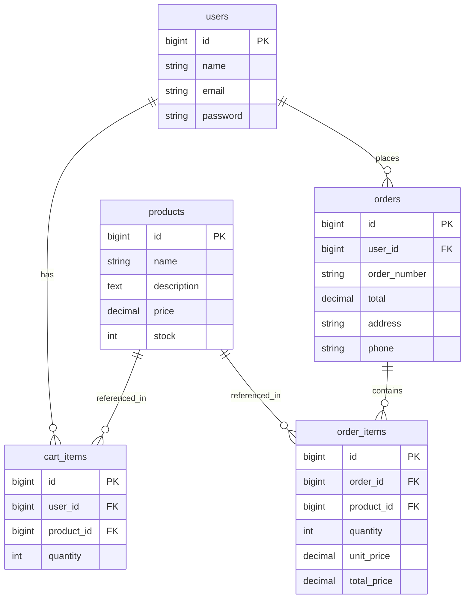

# Laravel E-commerce API

## Requirements
- PHP 8.1+
- Composer
- MySQL

## Setup
1. Clone repo
2. cp .env.example .env and set DB credentials and APP_URL
3. composer install
4. php artisan key:generate
5. php artisan jwt:secret
6. php artisan migrate
7. php artisan db:seed
8. php artisan serve

## API usage
- Register: POST /api/auth/register
  payload: {name, email, password, password_confirmation}
- Login: POST /api/auth/login
  payload: {email, password}
  returns token: store in Authorization: Bearer <token>
- All other endpoints require Authorization header.
- Products: GET/POST/PUT/DELETE /api/products
- Cart: GET /api/cart, POST /api/cart {product_id, quantity}, DELETE /api/cart/{id}
- Orders: POST /api/orders {address, phone} -> returns order_number, total, items

